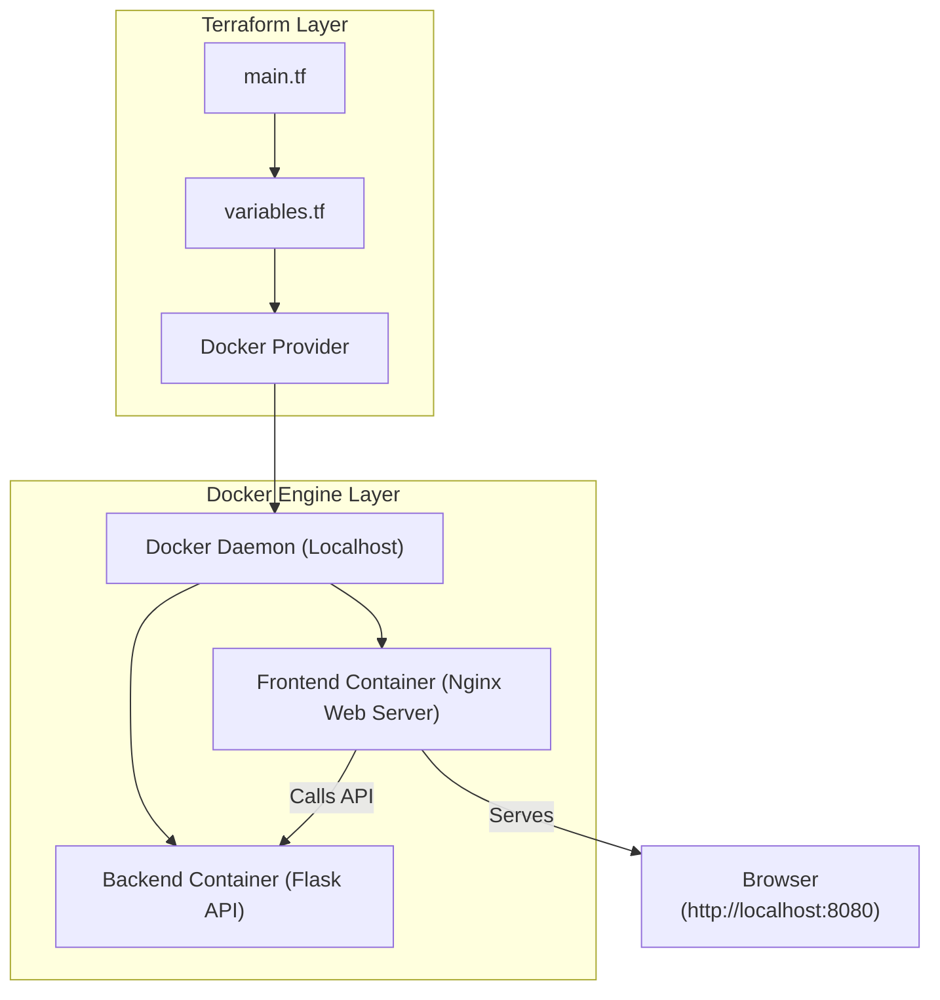

# Terraform Docker Provider — Two Tier Application Deployment

This project demonstrates how to automate the deployment of a **two-tier web application** using **Terraform’s Docker Provider**. It provisions two Docker containers — a **frontend (Nginx)** and a **backend (Flask API)** — connected through a Docker network, defined using **Infrastructure as Code (IaC)**.

---

## Overview

Terraform uses the **Docker Provider** to automate the following tasks:

* Build and manage Docker images for both frontend and backend services.
* Create and attach a private Docker network for inter-container communication.
* Deploy and expose both containers to the host for browser access.
* Manage all Docker resources declaratively using Terraform configuration files.

---

## Architecture



---

## Project Structure

```
terraform-docker-two-tier/
│
├── main.tf             # Defines Docker images, containers, and network resources
├── variables.tf        # Declares configurable input variables
├── outputs.tf          # Displays application endpoints
├── terraform.tfvars    # (Optional) User-defined variable values
├── frontend/           # Frontend container setup
│   ├── Dockerfile
│   └── index.html
└── backend/            # Backend container setup
    ├── Dockerfile
    ├── app.py
    └── requirements.txt
```

---

## Prerequisites

Ensure the following tools are installed:

* [Terraform](https://developer.hashicorp.com/terraform/downloads)
* [Docker](https://docs.docker.com/get-docker/)
* A working Docker environment (Docker Desktop or local daemon)

---

## Setup and Deployment

### Step 1: Initialize Terraform

```bash
terraform init
```

### Step 2: Validate the configuration

```bash
terraform validate
```

### Step 3: Preview the plan

```bash
terraform plan
```

### Step 4: Apply the configuration

```bash
terraform apply -auto-approve
```

Once the deployment is complete, open your browser and navigate to:

```
Frontend: http://localhost:8080
Backend:  http://localhost:5000/api
```

The frontend (Nginx) serves a static web page that communicates with the Flask API running in the backend container.

---

## Outputs

After applying the configuration, Terraform displays:

* **Frontend URL** — The local URL where the web UI is available.
* **Backend API URL** — The endpoint exposed by the Flask API.

---

## Destroying Resources

To remove all created Docker resources:

```bash
terraform destroy -auto-approve
```

---

## Learning Objectives

* Understand how to use Terraform’s **Docker Provider** for multi-container deployments.
* Learn to define container interconnectivity using Docker networks in Terraform.
* Explore Infrastructure as Code principles for two-tier architecture automation.

---

## Notes

If the containers do not appear in Docker Desktop, ensure Terraform uses the correct Docker daemon socket by setting the provider’s `host` value in `main.tf`:

```hcl
provider "docker" {
  host = "unix:///var/run/docker.sock"
}
```
